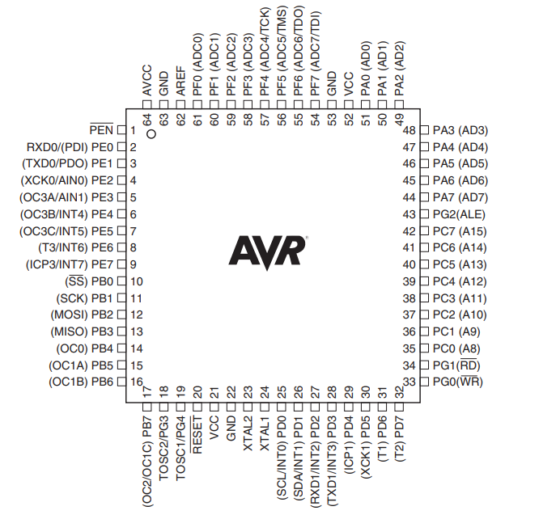

# T-Bird-Project
 Ez a projekt a Programozás 2 a Gyakorlatban miatt jött létre.
Ebben a projektben a fő cél a Bas (elterjedt további nevei: Mia, Maja, stb.) dobókockás játék rekonstrukciója.
### Szabályok - [Wikipedia](https://en.wikipedia.org/wiki/Mia_(game))
Az első dob a két kockával úgy, hogy a dobott értéket csak ő lássa. Ezek után közölni kell a dobás eredményét a következő szabályok figyelembe vételével:
- A dobott értéket kétjegyű számként olvassuk fel, ahol a nagyobb szám van a tízesek helyén, a kisebb pedig az egyesekén. Vagyis ha egy négyest és egy ötöst dobtunk, akkor az 54 és nem 45 lesz.
- Ha egyformát dobunk, akkor **bas**unk van (azaz 22 = 2-es bas vagy 66 = 6-os bas), ami viszont többet ér az előző pontban említett dobásoknál.
- Tehát a kidobható értékek a következő sorrendben überlik egymást: 31, 32, 41, 42, 43, 51, 52, 53, 54, 61, 62, 63, 64, 65, 1-es bas, 2-es bas, 3-as bas, 4-es bas, 5-ös bas, 6-os bas és végül a maja (21).
- Ha valaki 21-est dob (vagy maját mond) és a következő játékos elfogadja azt, akkor neki újra maját kell dobnia ha nyerni akar.
Valaki elkezdi a kört és dob, majd bejelenti, hogy mi az eredmény. Az utána következő játékos eldönti, hogy vajon igazat mond-e vagy sem.

Ha elhiszi, akkor neki a mondott értéknél mindenképpen nagyobbat kell majd dobnia és/vagy mondania, még akkor is, ha így hazugságra kényszerül. Ez esetben egyébként nem is kell megmutatni, hogy mi volt a valós eredmény, csak továbbadjuk a kockákat.

Ám ha a soron következő játékos nem hiszi el, amit mondtunk, meg kell mutatnunk a dobókockáinkat. Ha igazat mondtunk, akkor a soron következő játékostársunk veszít egy életet, viszont ha mi lódítottunk, akkor a mi életünkből megy le egy. Az új kört a vesztes játékos kezdi de ő ismét nulláról indul, tehát azt mond elsőnek, amit akar, nem kell semmit sem überelnie.

A menet addig tart amíg egy kivételével minden játékos el nem veszti az összes életét (általában 5 élettel játszunk).


-----------------------------------------------------
# Programming Setup


### Software
* Microchip Studio AVR Programmer

### Hardware - T-BIRD EXPBRD 4
* ATMEL AVR - Atmega128 mikrokontrolleler
* USB - soros átalakító
* Valós idejű óra (RTC - Real Time Clock, PCF8563)
* Piezzo buzzer
* Analóg hőmérséklet szenzor (LM35)
* RS-485 interfész (SN75176, belső védelemmel)
* USB és külső tápellátás lehetőség
* 5 db nyomógomb
* 8 db LED
* Integrált JTAG debugger (JTAG ICE)
* Védőbiztosíték
* Digitál - Analóg Átalakító
#### Accessory:
* HD44780 kompatibilis 16x4-es LCD kijelző
* 4db 7szegmenses kijelző
* 4x3-as mátrix billentyűzet
* RGB LED
*LM35 hőszenzor

### AVR - Atmega128 Pinout:

Chip|Pinout|Datasheet
---|---|---
**ATMega128**||[[link](https://ww1.microchip.com/downloads/en/DeviceDoc/doc2467.pdf)]


/resources/atmega128_datasheet.pdf

-----------------------------------------------------

# References, Useful links
* [AVR fuse calculator](http://www.engbedded.com/fusecalc)
* [AVR timer calculator](http://eleccelerator.com/avr-timer-calculator/)
* [T-bird](https://t-bird.webnode.hu/)

-----------------------------------------------------
# Usefull code parts

### CPU Speed
```C
#define F_CPU 8000000L
```

### Reading pins
```C
if(PIND&(1<<PD7)){doSomething();} // runs doSomething() if PD7 is HIGH
```

### Bit flipping in C
```c
PORTD|=(1<<PD6); // sets PD6 high
PORTD&=~(1<<PD6); // sets PD6 low
PORTD^=(1<<PD6); // flips the state of PD6
```

### Memory-Efficient Timers
```C
#include <util/delay.h>
void waitMs1(){_delay_ms(1);}
void waitMs(int ms){while (ms-->0){waitMs1();}}
void waitSec(int sec){while (sec-->0){waitMs(1000);}}
```
